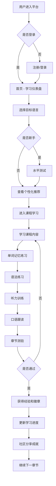
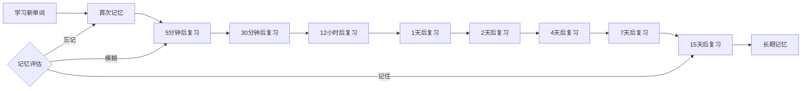
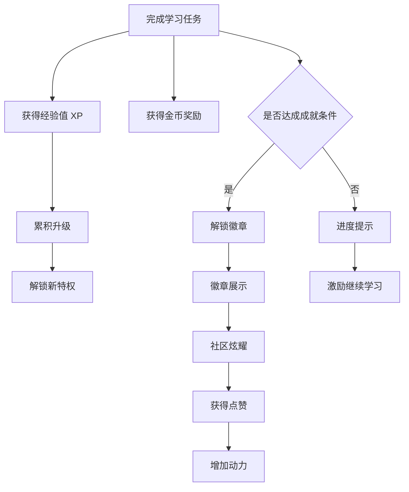

# LinguaVerse 多语种在线学习平台 - 产品需求文档

## 1. 产品概述

**LinguaVerse** 是一款沉浸式多语种在线教育平台，致力于通过游戏化学习、AI 个性化推荐和社区互动，打造高效有趣的语言学习体验。平台支持英语、日语、韩语、法语、西班牙语等主流语言，覆盖从入门到精通的全阶段学习。

- **产品使命**：让每一个人都能轻松掌握一门新语言
- **核心价值**：沉浸式学习体验 + 科学记忆方法 + 社区激励驱动
- **目标用户**：学生群体、职场人士、语言爱好者、出国准备者
- **差异化优势**：
  - 基于艾宾浩斯遗忘曲线的智能复习系统
  - 多模态互动学习（视/听/说/读/写）
  - 游戏化成长体系（等级、徽章、排行榜）
  - 真人发音 + AI 语音评测
  - 沉浸式社区学习氛围

## 2. 核心功能

### 2.1 用户角色

| 角色 | 注册方式 | 核心权限 |
|------|----------|----------|
| 学习者 | 邮箱/手机号注册 | 学习课程、互动练习、社区互动、查看进度、获得成就 |
| 访客 | 无需注册 | 浏览首页、查看课程介绍、体验部分功能 |

### 2.2 功能模块总览

1. **首页**：沉浸式导航、动态 Hero、语言世界地图、推荐课程、学习数据仪表盘
2. **课程中心**：分级课程体系、多维度筛选、课程详情、学习路径图
3. **单词记忆**：闪卡模式、选词填空、拼写练习、智能复习、单词本
4. **语法练习**：知识点讲解、选择练习、填空练习、错题本
5. **口语跟读**：原音播放、录音对比、AI 评分、逐句练习
6. **听力训练**：情景对话、新闻听力、听力填空、倍速播放
7. **学习进度**：数据统计、学习日历、能力雷达图、周报月报
8. **成就系统**：等级体系、徽章墙、成就任务、排行榜
9. **社区交流**：学习动态、话题广场、学习打卡、好友系统
10. **个人中心**：用户信息、学习设置、收藏夹、学习路径
11. **用户认证**：登录、注册、找回密码、个人信息设置

### 2.3 页面详情

| 页面名称 | 模块名称 | 功能描述 |
|----------|----------|----------|
| 首页 | 顶部导航 | Logo、语言切换、搜索、通知、登录/注册、用户头像菜单 |
| 首页 | Hero 区域 | 动态渐变背景、主标题打字机效果、副标题、双 CTA 按钮、浮动语言元素 |
| 首页 | 语言世界 | 交互式语言地图、语言卡片悬停效果、学习人数统计 |
| 首页 | 学习仪表盘 | 今日学习目标、连续打卡天数、单词量统计、环形进度图 |
| 首页 | 推荐课程 | 个性化推荐、横向滚动、课程卡片、进度指示 |
| 首页 | 学习路径 | 阶梯式进度展示、当前阶段、下一阶段目标 |
| 课程中心 | 筛选栏 | 语言选择、级别筛选、课程类型、排序方式 |
| 课程中心 | 课程网格 | 卡片式布局、封面图、难度标签、评分、学习人数、进度条 |
| 课程详情 | 课程头部 | 封面、标题、讲师信息、评分、难度、课程时长 |
| 课程详情 | 课程介绍 | 课程描述、学习目标、适合人群 |
| 课程详情 | 课程大纲 | 可展开章节树、课时列表、完成状态、锁定状态 |
| 课程详情 | 学员评价 | 评分分布、用户评价、标签筛选 |
| 单词记忆 | 学习模式选择 | 闪卡模式、选词填空、拼写练习、听音辨词 |
| 单词记忆 | 闪卡学习 | 3D 翻转卡片、正面单词+音标、背面释义+例句、记忆程度选择 |
| 单词记忆 | 选词填空 | 四选一、倒计时、连击奖励、即时反馈 |
| 单词记忆 | 单词本 | 已学单词、收藏单词、生词本、按熟练度筛选 |
| 语法练习 | 语法知识点 | 分类展示、讲解卡片、示例句子 |
| 语法练习 | 选择练习 | 题目展示、选项、解析、错题收集 |
| 语法练习 | 填空练习 | 句子填空、首字母提示、语法点关联 |
| 口语跟读 | 课程选择 | 按话题分类、难度分级、场景对话 |
| 口语跟读 | 练习界面 | 原音播放、波形显示、录音按钮、播放录音、AI 评分反馈 |
| 口语跟读 | 逐句练习 | 句子列表、每句评分、重点音标提示 |
| 听力训练 | 听力材料 | 对话/新闻/故事分类、难度等级、时长显示 |
| 听力训练 | 播放界面 | 音频播放器、波形进度、倍速控制、字幕切换 |
| 听力训练 | 答题练习 | 听后答题、原文对照、错题解析 |
| 学习进度 | 数据概览 | 总学习时长、已学单词、完成课程、正确率 |
| 学习进度 | 学习日历 | 热力图日历、打卡记录、连续天数 |
| 学习进度 | 能力分析 | 雷达图（听说读写）、各维度详情、进步曲线 |
| 学习进度 | 周报月报 | 本周/月总结、数据对比、下周/月建议 |
| 成就中心 | 等级展示 | 当前等级、经验条、下一等级、等级特权 |
| 成就中心 | 徽章墙 | 成就分类、已获得/未获得、徽章详情、解锁条件 |
| 成就中心 | 成就任务 | 每日任务、每周任务、成长任务、奖励展示 |
| 成就中心 | 排行榜 | 总榜、周榜、好友榜、语言榜 |
| 社区 | 动态流 | 学习打卡、心得分享、成就炫耀、点赞评论转发 |
| 社区 | 话题广场 | 热门话题、话题分类、话题详情、参与讨论 |
| 社区 | 学习小组 | 小组列表、加入小组、组内活动、打卡挑战 |
| 个人中心 | 个人信息 | 头像、昵称、简介、学习目标、目标语言 |
| 个人中心 | 学习路径 | 个性化学习计划、今日任务、进度追踪 |
| 个人中心 | 我的收藏 | 收藏的课程、单词、语法点 |
| 个人中心 | 设置 | 账号设置、学习提醒、隐私设置、通知偏好 |
| 登录页 | 登录表单 | 邮箱/手机号、密码、记住我、忘记密码、第三方登录 |
| 注册页 | 注册表单 | 邮箱、用户名、密码、确认密码、验证码、同意协议 |

## 3. 核心流程

### 3.1 用户学习主流程

### 3.2 智能复习流程

基于艾宾浩斯遗忘曲线的单词复习机制：

### 3.3 游戏化激励流程

## 4. 用户界面设计

### 4.1 设计风格

**设计理念**：沉浸式宇宙探索主题 - 将语言学习比作探索不同的语言星球，每个语言都是一个独特的世界等待用户去发现。

**视觉主题**：
- **主色调**：深邃宇宙蓝 (#0f172a → #1e293b) - 营造沉浸式探索感
- **星辰金**：#fbbf24 - 代表成就和荣耀
- **能量紫**：#8b5cf6 - 代表魔法和可能性
- **生命绿**：#10b981 - 代表成长和进步
- **热情橙**：#f97316 - 代表活力和热情
- **海洋蓝**：#0ea5e9 - 代表清晰和智慧

**字体系统**：
- **标题字体**：Space Grotesk - 未来科技感，适合宇宙主题
- **正文字体**：Inter - 清晰易读，现代简约
- **特殊字体**：Playfair Display（用于强调性标题和引语）

**设计元素**：
- **玻璃拟态**：半透明毛玻璃效果的卡片和面板
- **发光效果**：按钮、图标、进度条的柔和发光
- **星空背景**：微妙的星点动画背景
- **渐变叠加**：多层渐变营造深度感
- **几何装饰**：圆形、线条、网格等科技感元素
- **微动效**：悬浮、呼吸、脉冲等细腻动画

**交互风格**：
- **按钮**：圆角矩形、渐变背景、悬停发光、点击缩放
- **卡片**：圆角、微妙边框、悬停上浮、阴影加深
- **输入框**：简约线条、聚焦发光、错误抖动
- **图标**：线性图标 + 渐变填充、悬停旋转/缩放

### 4.2 页面设计概览

| 页面名称 | 模块名称 | UI 元素与动效 |
|----------|----------|---------------|
| 首页 | Hero 区域 | 动态渐变星空背景、标题渐入打字机效果、浮动语言球、CTA 按钮脉冲发光 |
| 首页 | 语言世界 | 交互式星系布局、行星式语言卡片、轨道动画、悬停放大发光 |
| 首页 | 学习仪表盘 | 玻璃态卡片、环形进度条动画、数字滚动计数、图标呼吸效果 |
| 课程中心 | 课程卡片 | 封面图渐变叠加、进度条发光、悬停上浮动效、收藏按钮心形动画 |
| 单词记忆 | 闪卡 | 3D 翻转动画、正反面渐变、记忆按钮反馈动效、卡片切换过渡 |
| 单词记忆 | 选词练习 | 选项悬停效果、正确答案绿色发光扩散、错误答案红色抖动、连击特效 |
| 口语跟读 | 波形图 | 实时音频波形动画、播放进度指示、录音时脉冲效果 |
| 学习进度 | 日历热力图 | 日期格子颜色深浅表示学习时长、悬停显示详情、月份切换过渡 |
| 学习进度 | 能力雷达图 | SVG 雷达图、数据填充动画、各维度标签、能力提升对比 |
| 成就中心 | 徽章墙 | 金属质感徽章、已获得发光效果、未获得灰色半透明、悬停翻转显示详情 |
| 社区 | 动态卡片 | 用户头像、内容展示、互动按钮动效、图片瀑布流 |

### 4.3 响应式设计

**设计原则**：桌面端优先，优雅降级到移动端

- **断点设置**：
  - `sm`: 640px（手机横屏）
  - `md`: 768px（平板）
  - `lg`: 1024px（小屏桌面）
  - `xl`: 1280px（标准桌面）
  - `2xl`: 1536px（大屏桌面）

- **移动端优化**：
  - 底部导航栏（5个核心入口）
  - 卡片堆叠布局
  - 触控友好按钮（最小 44px）
  - 手势操作支持（滑动翻卡、下拉刷新）
  - 简化的信息展示

- **平板适配**：
  - 侧边栏导航
  - 双列/三列网格布局
  - 分屏内容展示

### 4.4 动效设计原则

1. **页面入场**：错峰渐入动画（元素依次淡入上移）
2. **状态变化**：平滑过渡（300ms ease-out）
3. **微交互**：按钮悬停、图标旋转、进度填充
4. **反馈动效**：正确/错误提示、奖励获得动画
5. **滚动效果**：视差滚动、元素进入视口触发动画
6. **加载状态**：骨架屏、脉冲动画、进度条

### 4.5 无障碍设计

- 语义化 HTML 结构
- 合适的颜色对比度（WCAG AA 标准）
- 键盘导航支持
- 屏幕阅读器友好
- 可调整的字体大小
- 减少动画选项（尊重用户系统设置）
