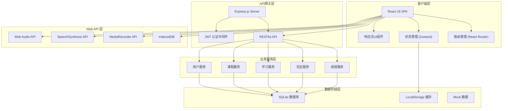
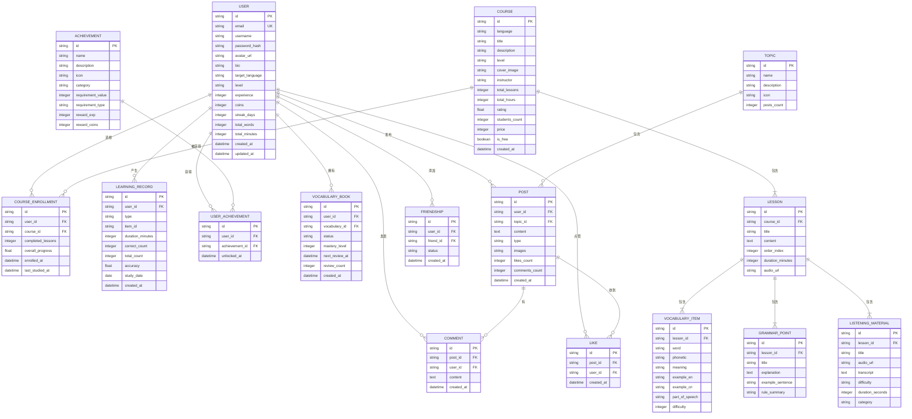

# LinguaVerse 多语种在线学习平台 - 技术架构文档

## 1. 整体架构设计



## 2. 技术选型详细说明

### 2.1 前端技术栈

| 技术 | 版本 | 用途 | 选择理由 |
|------|------|------|----------|
| React | 18.x | UI 框架 | 组件化开发、生态丰富、性能优秀 |
| TypeScript | 5.x | 类型系统 | 类型安全、更好的开发体验、可维护性 |
| Vite | 5.x | 构建工具 | 极速开发体验、热更新快、构建优化 |
| Tailwind CSS | 3.x | 样式框架 | 原子化 CSS、快速开发、一致的设计系统 |
| Zustand | 4.x | 状态管理 | 轻量、简单、高性能、TypeScript 友好 |
| React Router DOM | 6.x | 路由管理 | 声明式路由、嵌套路由、懒加载支持 |
| Lucide React | latest | 图标库 | 现代简洁、一致性好、树摇优化 |

### 2.2 后端技术栈

| 技术 | 版本 | 用途 | 选择理由 |
|------|------|------|----------|
| Express.js | 4.x | Web 框架 | 轻量、灵活、生态成熟 |
| TypeScript | 5.x | 类型系统 | 与前端统一技术栈、类型安全 |
| JWT | 9.x | 身份认证 | 无状态认证、跨域友好 |
| SQLite | 3.x | 数据库 | 轻量、零配置、适合开发演示 |
| bcryptjs | 2.x | 密码加密 | 安全的密码哈希 |

### 2.3 浏览器 API 应用

| API | 用途 | 应用场景 |
|-----|------|----------|
| Web Audio API | 音频处理 | 听力材料播放、音效反馈 |
| SpeechSynthesis API | 文本转语音 | 单词发音、口语示范 |
| MediaRecorder API | 录音功能 | 口语跟读练习录音 |
| localStorage | 本地存储 | 用户偏好、学习缓存 |
| IndexedDB | 离线数据 | 离线课程内容、学习记录 |
| Intersection Observer | 滚动动画 | 元素进入视口触发动画 |

## 3. 路由定义

### 3.1 前端路由

| 路由路径 | 页面组件 | 权限 | 说明 |
|----------|----------|------|------|
| `/` | Home | 公开 | 首页 - Hero、语言选择、推荐、仪表盘 |
| `/courses` | Courses | 公开 | 课程中心 - 课程列表、筛选 |
| `/courses/:id` | CourseDetail | 公开 | 课程详情 - 介绍、大纲、评价 |
| `/learn/vocabulary` | Vocabulary | 需要登录 | 单词记忆 - 闪卡、选词、拼写 |
| `/learn/grammar` | Grammar | 需要登录 | 语法练习 - 选择、填空 |
| `/learn/speaking` | Speaking | 需要登录 | 口语跟读 - 录音、评分 |
| `/learn/listening` | Listening | 需要登录 | 听力训练 - 音频、答题 |
| `/progress` | Progress | 需要登录 | 学习进度 - 统计、日历、雷达图 |
| `/achievements` | Achievements | 需要登录 | 成就中心 - 等级、徽章、任务、排行 |
| `/community` | Community | 需要登录 | 社区交流 - 动态、话题、小组 |
| `/profile` | Profile | 需要登录 | 个人中心 - 信息、设置、收藏 |
| `/login` | Login | 公开 | 登录页面 |
| `/register` | Register | 公开 | 注册页面 |
| `*` | NotFound | 公开 | 404 页面 |

### 3.2 后端 API 路由

| 方法 | 路径 | 模块 | 说明 |
|------|------|------|------|
| POST | `/api/auth/register` | 认证 | 用户注册 |
| POST | `/api/auth/login` | 认证 | 用户登录 |
| GET | `/api/auth/profile` | 认证 | 获取用户信息 |
| PUT | `/api/auth/profile` | 认证 | 更新用户信息 |
| GET | `/api/courses` | 课程 | 获取课程列表 |
| GET | `/api/courses/:id` | 课程 | 获取课程详情 |
| GET | `/api/courses/:id/lessons` | 课程 | 获取课程章节 |
| GET | `/api/vocabulary` | 学习 | 获取单词列表 |
| POST | `/api/vocabulary/progress` | 学习 | 记录单词学习进度 |
| GET | `/api/grammar/exercises` | 学习 | 获取语法练习题 |
| POST | `/api/grammar/progress` | 学习 | 记录语法练习进度 |
| GET | `/api/listening/materials` | 学习 | 获取听力材料 |
| GET | `/api/progress/overview` | 进度 | 获取学习概览 |
| GET | `/api/progress/weekly` | 进度 | 获取周学习数据 |
| GET | `/api/progress/calendar` | 进度 | 获取学习日历 |
| GET | `/api/achievements` | 成就 | 获取成就列表 |
| GET | `/api/achievements/rankings` | 成就 | 获取排行榜 |
| GET | `/api/community/posts` | 社区 | 获取动态列表 |
| POST | `/api/community/posts` | 社区 | 发布动态 |
| POST | `/api/community/posts/:id/like` | 社区 | 点赞/取消点赞 |
| GET | `/api/community/topics` | 社区 | 获取话题列表 |

## 4. 数据模型设计

### 4.1 ER 图



### 4.2 TypeScript 类型定义

```typescript
// 用户相关
export interface User {
  id: string;
  email: string;
  username: string;
  avatarUrl: string;
  bio: string;
  targetLanguage: string;
  level: 'beginner' | 'intermediate' | 'advanced';
  experience: number;
  coins: number;
  streakDays: number;
  totalWords: number;
  totalMinutes: number;
  createdAt: string;
  updatedAt: string;
}

export interface AuthState {
  user: User | null;
  token: string | null;
  isLoading: boolean;
  isAuthenticated: boolean;
}

// 课程相关
export interface Course {
  id: string;
  language: string;
  title: string;
  description: string;
  level: 'beginner' | 'intermediate' | 'advanced';
  coverImage: string;
  instructor: string;
  totalLessons: number;
  totalHours: number;
  rating: number;
  studentsCount: number;
  price: number;
  isFree: boolean;
  createdAt: string;
  lessons?: Lesson[];
}

export interface Lesson {
  id: string;
  courseId: string;
  title: string;
  content: string;
  orderIndex: number;
  durationMinutes: number;
  audioUrl?: string;
  vocabulary?: VocabularyItem[];
  grammarPoints?: GrammarPoint[];
  listeningMaterials?: ListeningMaterial[];
}

export interface VocabularyItem {
  id: string;
  lessonId: string;
  word: string;
  phonetic: string;
  meaning: string;
  exampleEn: string;
  exampleCn: string;
  partOfSpeech: string;
  difficulty: number;
}

export interface GrammarPoint {
  id: string;
  lessonId: string;
  title: string;
  explanation: string;
  exampleSentence: string;
  ruleSummary: string;
}

export interface ListeningMaterial {
  id: string;
  lessonId: string;
  title: string;
  audioUrl: string;
  transcript: string;
  difficulty: string;
  durationSeconds: number;
  category: string;
}

// 学习进度
export interface LearningProgress {
  userId: string;
  totalMinutes: number;
  totalWords: number;
  completedCourses: number;
  completedLessons: number;
  streakDays: number;
  accuracy: number;
  weeklyData: DailyRecord[];
  calendarData: CalendarData;
}

export interface DailyRecord {
  date: string;
  minutes: number;
  words: number;
  lessonsCompleted: number;
}

export interface CalendarData {
  [date: string]: {
    minutes: number;
    words: number;
  };
}

export interface SkillRadar {
  vocabulary: number;
  grammar: number;
  listening: number;
  speaking: number;
  reading: number;
  writing: number;
}

// 成就系统
export interface Achievement {
  id: string;
  name: string;
  description: string;
  icon: string;
  category: 'streak' | 'words' | 'lessons' | 'level' | 'social' | 'special';
  requirementValue: number;
  requirementType: string;
  rewardExp: number;
  rewardCoins: number;
  unlocked?: boolean;
  unlockedAt?: string;
  progress?: number;
}

export interface RankingItem {
  userId: string;
  username: string;
  avatarUrl: string;
  value: number;
  rank: number;
}

// 社区相关
export interface Post {
  id: string;
  userId: string;
  user: User;
  topicId?: string;
  topic?: Topic;
  content: string;
  type: 'checkin' | 'discussion' | 'achievement' | 'question';
  images?: string[];
  likesCount: number;
  commentsCount: number;
  isLiked: boolean;
  createdAt: string;
}

export interface Comment {
  id: string;
  postId: string;
  userId: string;
  user: User;
  content: string;
  createdAt: string;
}

export interface Topic {
  id: string;
  name: string;
  description: string;
  icon: string;
  postsCount: number;
}

// 练习相关
export interface QuizQuestion {
  id: string;
  type: 'choice' | 'fill' | 'listen' | 'speak';
  question: string;
  options?: string[];
  correctAnswer: string;
  explanation?: string;
  audioUrl?: string;
  difficulty: number;
}

export interface QuizResult {
  questionId: string;
  userAnswer: string;
  isCorrect: boolean;
  timeSpent: number;
}
```

## 5. 项目目录结构

```
/workspace
├── src/                          # 前端源码
│   ├── components/               # 可复用组件
│   │   ├── layout/              # 布局组件
│   │   │   ├── Navbar.tsx       # 顶部导航栏
│   │   │   ├── Footer.tsx       # 页脚
│   │   │   ├── Sidebar.tsx      # 侧边栏
│   │   │   └── MobileNav.tsx    # 移动端底部导航
│   │   ├── common/              # 通用组件
│   │   │   ├── Button.tsx       # 按钮组件
│   │   │   ├── Card.tsx         # 卡片组件
│   │   │   ├── Modal.tsx        # 模态框
│   │   │   ├── ProgressBar.tsx  # 进度条
│   │   │   ├── RingProgress.tsx # 环形进度
│   │   │   ├── Badge.tsx        # 徽章
│   │   │   ├── Avatar.tsx       # 头像
│   │   │   ├── Tabs.tsx         # 标签页
│   │   │   ├── Input.tsx        # 输入框
│   │   │   └── Skeleton.tsx     # 骨架屏
│   │   ├── course/              # 课程相关组件
│   │   │   ├── CourseCard.tsx
│   │   │   ├── CourseFilter.tsx
│   │   │   └── LessonList.tsx
│   │   ├── learn/               # 学习模块组件
│   │   │   ├── FlashCard.tsx    # 闪卡组件
│   │   │   ├── QuizChoice.tsx   # 选择题组件
│   │   │   ├── AudioPlayer.tsx  # 音频播放器
│   │   │   ├── VoiceRecorder.tsx # 录音组件
│   │   │   └── Waveform.tsx     # 波形图组件
│   │   ├── progress/            # 进度相关组件
│   │   │   ├── CalendarHeatmap.tsx
│   │   │   ├── RadarChart.tsx
│   │   │   └── StatCard.tsx
│   │   ├── achievements/        # 成就相关组件
│   │   │   ├── BadgeCard.tsx
│   │   │   ├── LevelProgress.tsx
│   │   │   └── RankingList.tsx
│   │   └── community/           # 社区相关组件
│   │       ├── PostCard.tsx
│   │       ├── CommentList.tsx
│   │       └── TopicCard.tsx
│   ├── pages/                    # 页面组件
│   │   ├── Home.tsx             # 首页
│   │   ├── Courses.tsx          # 课程中心
│   │   ├── CourseDetail.tsx     # 课程详情
│   │   ├── Vocabulary.tsx       # 单词记忆
│   │   ├── Grammar.tsx          # 语法练习
│   │   ├── Speaking.tsx         # 口语跟读
│   │   ├── Listening.tsx        # 听力训练
│   │   ├── Progress.tsx         # 学习进度
│   │   ├── Achievements.tsx     # 成就中心
│   │   ├── Community.tsx        # 社区交流
│   │   ├── Profile.tsx          # 个人中心
│   │   ├── Login.tsx            # 登录页
│   │   ├── Register.tsx         # 注册页
│   │   └── NotFound.tsx         # 404页
│   ├── store/                    # Zustand 状态管理
│   │   ├── useAuthStore.ts      # 认证状态
│   │   ├── useCourseStore.ts    # 课程状态
│   │   ├── useProgressStore.ts  # 进度状态
│   │   └── useUIModalStore.ts   # UI 状态
│   ├── hooks/                    # 自定义 Hooks
│   │   ├── useAudio.ts          # 音频播放 hook
│   │   ├── useRecording.ts      # 录音 hook
│   │   ├── useSpeech.ts         # 语音合成 hook
│   │   ├── useTimer.ts          # 计时器 hook
│   │   └── useScrollAnimation.ts # 滚动动画 hook
│   ├── utils/                    # 工具函数
│   │   ├── api.ts               # API 请求封装
│   │   ├── helpers.ts           # 通用工具函数
│   │   ├── constants.ts         # 常量定义
│   │   └── animations.ts        # 动画配置
│   ├── types/                    # TypeScript 类型
│   │   └── index.ts
│   ├── data/                     # Mock 数据
│   │   ├── courses.ts           # 课程数据
│   │   ├── vocabulary.ts        # 单词数据
│   │   ├── grammar.ts           # 语法数据
│   │   ├── achievements.ts      # 成就数据
│   │   ├── community.ts         # 社区数据
│   │   └── user.ts              # 用户数据
│   ├── styles/                   # 全局样式
│   │   ├── globals.css          # 全局 CSS
│   │   └── animations.css       # 动画 CSS
│   ├── App.tsx                  # 根组件
│   ├── main.tsx                 # 入口文件
│   └── vite-env.d.ts
├── api/                          # 后端源码
│   ├── routes/                   # 路由
│   │   ├── auth.ts              # 认证路由
│   │   ├── courses.ts           # 课程路由
│   │   ├── learn.ts             # 学习路由
│   │   ├── progress.ts          # 进度路由
│   │   ├── achievements.ts      # 成就路由
│   │   └── community.ts         # 社区路由
│   ├── middleware/               # 中间件
│   │   └── auth.ts              # 认证中间件
│   ├── data/                     # 数据
│   │   └── mockData.ts          # Mock 数据
│   ├── utils/                    # 工具
│   │   └── helpers.ts
│   ├── types/                    # 类型
│   │   └── index.ts
│   └── server.ts                 # 服务入口
├── shared/                       # 共享类型
│   └── types.ts
├── public/                       # 静态资源
│   ├── images/
│   ├── audio/
│   └── favicon.ico
├── .trae/
│   └── documents/
│       ├── PRD-多语种学习平台.md
│       └── 技术架构文档.md
├── package.json
├── tsconfig.json
├── tsconfig.node.json
├── vite.config.ts
├── tailwind.config.js
├── postcss.config.js
├── index.html
└── README.md
```

## 6. 关键技术实现方案

### 6.1 闪卡 3D 翻转效果

使用 CSS 3D transforms 实现：

```css
.flashcard-container {
  perspective: 1000px;
}

.flashcard {
  transform-style: preserve-3d;
  transition: transform 0.6s;
}

.flashcard.flipped {
  transform: rotateY(180deg);
}

.flashcard-front,
.flashcard-back {
  backface-visibility: hidden;
  position: absolute;
  width: 100%;
  height: 100%;
}

.flashcard-back {
  transform: rotateY(180deg);
}
```

### 6.2 学习进度日历热力图

使用 CSS Grid + 动态颜色计算实现：

- 7列（周一到周日）多行布局
- 根据学习时长计算颜色深浅
- 悬停显示详细数据 tooltip

### 6.3 能力雷达图

使用 SVG 多边形实现：

- 六边形雷达图（6个维度）
- 动态计算各顶点坐标
- 动画填充效果
- 支持对比显示

### 6.4 语音功能实现

- **TTS 发音**：使用 `window.speechSynthesis` API
- **录音功能**：使用 `MediaRecorder` API
- **音频可视化**：使用 `Web Audio API` + Canvas 绘制波形

### 6.5 艾宾浩斯复习算法

```typescript
// 复习间隔（天数）
const REVIEW_INTERVALS = [
  { level: 0, interval: 0 },      // 刚学习，5分钟后
  { level: 1, interval: 1 },      // 1天后
  { level: 2, interval: 2 },      // 2天后
  { level: 3, interval: 4 },      // 4天后
  { level: 4, interval: 7 },      // 7天后
  { level: 5, interval: 15 },     // 15天后
  { level: 6, interval: 30 },     // 30天后
  { level: 7, interval: -1 },     // 已掌握
];

function calculateNextReview(masteryLevel: number, quality: number): Date {
  // quality: 0=完全忘记, 1=模糊, 2=记得, 3=完全掌握
  // 根据回答质量调整掌握程度，计算下次复习时间
}
```

### 6.6 状态管理架构

使用 Zustand 进行模块化状态管理：

- **authStore**：用户认证状态
- **courseStore**：课程数据和筛选状态
- **progressStore**：学习进度数据
- **uiStore**：UI 交互状态（模态框、侧边栏等）

持久化方案：使用 `persist` 中间件将 auth 状态持久化到 localStorage。

## 7. 性能优化策略

### 7.1 前端优化

- **代码分割**：路由级别的 lazy loading
- **图片优化**：WebP 格式、懒加载、响应式图片
- **虚拟列表**：长列表使用虚拟滚动
- **防抖节流**：搜索、滚动等高频操作
- **缓存策略**：React Query / SWR 风格的数据缓存
- **CSS 优化**：Tailwind 原子化 + 构建时 purge

### 7.2 构建优化

- Vite 构建优化（rollup 插件）
- 生产环境代码压缩
- Tree Shaking
- 资源预加载

## 8. 安全考虑

- JWT 令牌安全存储（HttpOnly Cookie / localStorage）
- XSS 防护（React 自动转义 + CSP）
- CSRF 防护
- 密码加密存储（bcrypt）
- 输入验证和清理
- API 速率限制
